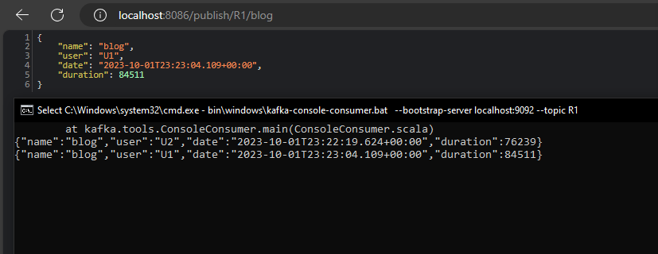
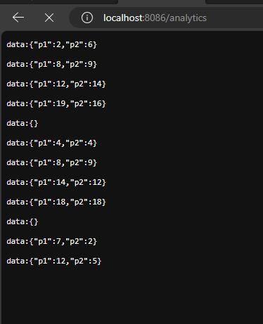
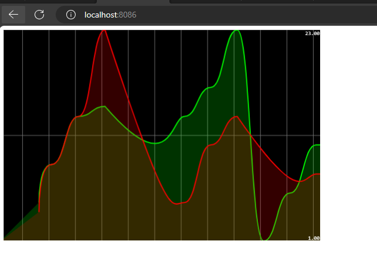

take a message from R2 then send it to R3 

<h3>e4 kafka streamer</h3>

Producer

<pre>start bin\windows\kafka-console-producer.bat --broker-list  localhost:9092 --topic R1</pre>

Consumer

<pre>start bin\windows\kafka-console-consumer.bat --bootstrap-server localhost:9092 --topic R2</pre>
<h3>Kafka Stream API (Stream Processing Consumer)</h3>

command 

<pre>start bin\windows\kafka-console-consumer.bat --bootstrap-server localhost:9092 --topic R4 --property print.key=true --property print.value=true --property key.deserializer=org.apache.kafka.common.serialization.StringDeserializer --property value.deserializer=org.apache.kafka.common.serialization.LongDeserializer</pre>
<h4>Every second show me the statistics</h4>
analytics function

